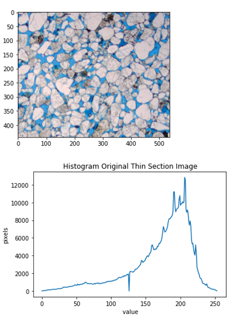
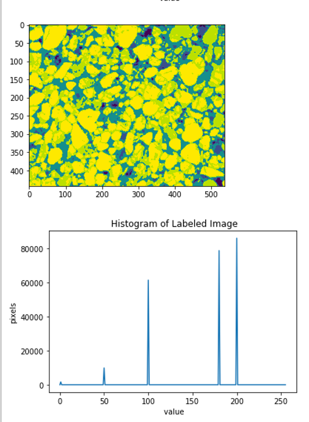

# Create-Thin-Section-Labels
Create Labels for Thin Sections for image-segmentation-keras:

This repository is meant to document the steps being employed to create a labeled Thin Section image for the image segmentation using Keras per Divam Gupta's GitHub repository. 

The objective of this repository is to label different types of grains or blue dye epoxy (which represents visual porosity) observed in clastic petrographic thin sections of rock samples. The following image is an example of a typical clastic rock thin section and the histogram of the pixel values:

We read in the original Thin Section image and create a Numpy array. 

    TS_Im = Image.open(img)
    
    data = np.array(TS_Im) 

We then convert the color image to a gray-level image using the following code:

    gradient = gaussian(rgb2gray(data)) 

using skimage filter gaussian (or median) filters and skimage rgb2gray. 

The following is an example of the gray-level image and histogram of these data scaled 0 to 1.  

We then partition the gray-level image data into different bins which will serve as our labels:

 
    label = np.zeros(gradient.shape )

    label[gradient < 0.25] = 1 #black grains 
    label[gradient > 0.25] = 50 #darker grains
    label[gradient > 0.4]  = 100 #blue-dye epoxy or visual porosity  
    label[gradient > 0.6]  = 180 #darker grains 
    label[gradient > 0.75]  = 200 #bright quartz grains   

We are scaling our label data from 0 to 255 to create 5 labels that represent the various segments in the image. We use the python program "review_images_Create_Labels_1-255.py" to create these labels scaled from 0 to 255. We could also use "review_images_Create_Labels.py" to scale the label images from 0 to 1. The immediate value in scaling the labeled images from 1-255 is that the labeled images can be viewed with a common image viewer. However, I am not sure what is best for image segmentation in having labels scaled from 1-5 or 1-200??? 

These labeled images will then be used as the annotated labels for our image segmentation training. 

The histogram verifies that we have 5 labels in our saved label images.

There is another python program that should be driven from the xterm command line:

>> python interactive_plot

to interactively display the pixel values of one of the label images to ensure that the label cutoffs for segmentation are optimized for the threshold values and the different labeled segments are well understood.

 

